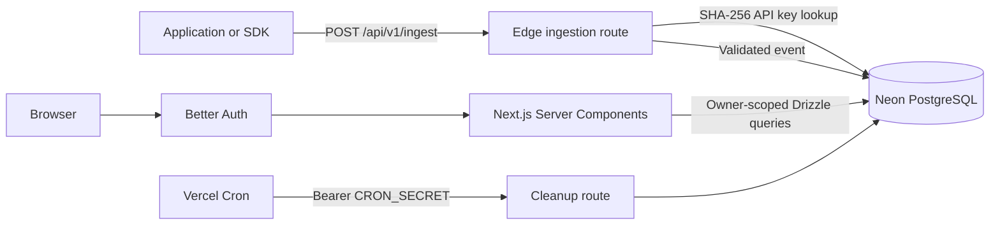

# PulseLog

PulseLog is a lightweight, developer-focused API observability and error-tracking application. It accepts structured request events through an authenticated ingestion endpoint, stores them in Neon PostgreSQL, and presents request volume, p95 latency, errors, and searchable JSON metadata in a responsive dashboard.

The public product and API documentation is available on the application homepage at [http://localhost:3000](http://localhost:3000).

## What PulseLog includes

- Better Auth email/password, verification, password reset, Google OAuth, and GitHub OAuth flows.
- Authenticated onboarding with private, user-owned workspaces.
- Strict multi-tenant authorization for workspace reads and mutations.
- SHA-256-hashed API keys whose raw secrets are shown only once.
- Edge-compatible event ingestion with Zod validation.
- Real 24-hour request, p95 latency, and 5xx error-rate analytics.
- Hourly 2xx, 4xx, and 5xx time-series visualization.
- Database-backed logs with URL-based status, route, metadata, and time filters.
- A responsive event inspector for JSON metadata, errors, and stack traces.
- Workspace settings, renaming, and cascading deletion.
- Daily cleanup with 14-day retention and a 50,000-event cap per workspace.
- Radian UI, Tailwind CSS, and responsive dark/light themes.

## Architecture



The authenticated dashboard uses Server Components for reads and Server Actions for mutations. Client Components are limited to interactions such as charts, URL filter controls, dialogs, copying credentials, and opening the event drawer.

## Technology

| Area | Implementation |
| --- | --- |
| Framework | Next.js App Router, React 19, TypeScript |
| UI | Radian UI, Radix primitives, Tailwind CSS v4, Lucide |
| Charts | Recharts with Radian chart wrappers |
| Authentication | Better Auth |
| Database | Neon PostgreSQL and Drizzle ORM |
| Validation | Zod |
| Email | Nodemailer |
| Deployment | Vercel and Vercel Cron |

The repository currently pins Next.js 16.0.10. Its route and data architecture follows the modern App Router patterns used by Next.js 15 and later.

## Local setup

### Requirements

- Node.js 20.9 or newer
- pnpm
- A PostgreSQL database, preferably Neon
- SMTP credentials if email verification and password recovery will send real email
- Google or GitHub OAuth credentials if those providers will be used

### 1. Clone and install

```bash
git clone git@github.com:Ashmit72/pulselog.git
cd pulselog
pnpm install
```

### 2. Configure the environment

Copy the example file and replace every required value:

```bash
cp .env.example .env
```

| Variable | Required | Purpose |
| --- | --- | --- |
| `DATABASE_URL` | Yes | Neon or PostgreSQL connection string. |
| `BETTER_AUTH_SECRET` | Yes | Secret used by Better Auth. Generate a long random value. |
| `NEXT_PUBLIC_APP_URL` | Yes | Application origin, such as `http://localhost:3000`. |
| `CRON_SECRET` | Production | Bearer secret protecting `/api/cron/cleanup`. |
| `GOOGLE_CLIENT_ID` | For Google login | Google OAuth client ID. |
| `GOOGLE_CLIENT_SECRET` | For Google login | Google OAuth client secret. |
| `GITHUB_CLIENT_ID` | For GitHub login | GitHub OAuth application ID. |
| `GITHUB_CLIENT_SECRET` | For GitHub login | GitHub OAuth application secret. |
| `SMTP_HOST` | For email delivery | SMTP server hostname. |
| `SMTP_PORT` | For email delivery | Usually `587` or `465`. |
| `SMTP_SECURE` | For email delivery | Use `true` for implicit TLS, normally port 465. |
| `SMTP_USER` | For email delivery | SMTP username. |
| `SMTP_PASS` | For email delivery | SMTP password. |
| `EMAIL_FROM` | For email delivery | Authorized sender address. |

Generate suitable application secrets with a password manager or a cryptographically secure command such as:

```bash
openssl rand -base64 32
```

Never commit `.env`, raw API keys, OAuth secrets, SMTP credentials, or database credentials.

### 3. Apply database migrations

```bash
pnpm db:migrate
```

When changing `src/db/schema.ts`, generate and review a new migration before applying it:

```bash
pnpm db:generate
pnpm db:migrate
```

`pnpm db:push` is available for disposable development databases. Do not combine schema push and migrations casually against the same production database.

### 4. Start PulseLog

```bash
pnpm dev
```

Open [http://localhost:3000](http://localhost:3000). Create an account, complete email verification when configured, and create a workspace through onboarding.

## Application flow

1. A user signs in through Better Auth.
2. Onboarding inserts a workspace with the current user as `ownerId`.
3. The dynamic `/[workspaceId]` layout validates that the workspace belongs to the session user.
4. The user creates an API key. PulseLog returns the raw `pl_live_...` secret once and stores only its SHA-256 hash.
5. An application submits structured events to `/api/v1/ingest`.
6. Dashboard Server Components read workspace-scoped analytics and logs from Neon.
7. The protected cleanup job enforces event retention and per-workspace capacity.

## Ingestion API

### Endpoint

```text
POST /api/v1/ingest
Content-Type: application/json
x-api-key: pl_live_YOUR_API_KEY
```

The API key determines the event's workspace. A client cannot provide or override `workspaceId`.

### Example request

```bash
curl --request POST \
  --url http://localhost:3000/api/v1/ingest \
  --header 'content-type: application/json' \
  --header 'x-api-key: pl_live_YOUR_API_KEY' \
  --data '{
    "service_name": "checkout-api",
    "route": "/api/orders",
    "status_code": 201,
    "duration_ms": 86,
    "metadata": {
      "method": "POST",
      "region": "ap-south-1",
      "request_id": "req_01JEXAMPLE"
    }
  }'
```

### Payload

| Field | Type | Required | Validation |
| --- | --- | --- | --- |
| `service_name` | string | Yes | Trimmed, 1–255 characters. |
| `route` | string | Yes | Trimmed, 1–255 characters. |
| `status_code` | integer | Yes | 100–599. |
| `duration_ms` | integer | Yes | Must be zero or greater. |
| `error_message` | string or null | No | Truncated to 2,000 Unicode characters. |
| `metadata` | JSON object | No | Defaults to `{}`; serialized size must not exceed 8,192 bytes. |

The database schema does not have a dedicated HTTP method column. Add `metadata.method` or `metadata.request.method` when the method should appear in the Logs table.

### Accepted response

```json
{
  "success": true,
  "eventId": "7ad8c5d4-..."
}
```

Successful ingestion returns HTTP `202 Accepted`.

### Error responses

| Status | Meaning |
| --- | --- |
| `400` | Invalid JSON or an invalid event payload. |
| `401` | Missing or invalid API key. |
| `413` | Metadata is larger than 8 KB. |
| `500` | The event could not be stored. |
| `503` | API-key authentication storage is temporarily unavailable. |

Errors use this shape:

```json
{
  "success": false,
  "error": "Human-readable error"
}
```

Validation failures can also include a `details` array.

## Dashboard

### Overview

The overview reads the authenticated workspace's events from the previous 24 hours and calculates:

- Total requests
- Distinct services
- p95 request latency
- HTTP 5xx error rate
- Hourly 2xx, 4xx, and 5xx event counts

If the workspace has no events, the dashboard shows an empty state rather than sample data.

### Logs

The Logs page retrieves the newest 100 matching events. Filters are stored in the URL, making searches bookmarkable and shareable:

| Parameter | Example | Behavior |
| --- | --- | --- |
| `status` | `500` | Exact HTTP status. |
| `status` | `5xx` | Status class. `2xx` and `4xx` are also supported. |
| `route` | `/api/orders` | Exact route match. |
| `q` | `timeout` | Case-insensitive search over service, route, error message, and JSON metadata. |
| `range` | `1h` | One of `15m`, `1h`, `24h`, or `7d`. |

Example:

```text
/<workspaceId>/logs?status=5xx&route=%2Fapi%2Forders&q=timeout&range=24h
```

Selecting an event opens the detail drawer with its full metadata JSON, error message, and stack trace when `metadata.stack` or `metadata.error.stack` is present.

Logs are refreshed using the Refresh button or normal page navigation. The application does not currently maintain a WebSocket or server-sent-event connection.

## API keys

- Raw keys use the prefix `pl_live_` and contain 24 random bytes encoded as base64url.
- The server stores a unique 64-character SHA-256 hash.
- The raw secret is returned only by the successful creation action.
- Existing keys display only their name and creation time.
- Revocation deletes the key after verifying that its workspace belongs to the session user.
- Revoked credentials immediately fail ingestion authentication.

If a key is lost, revoke it and create a replacement. It cannot be recovered from the stored hash.

## Multi-tenancy and security

- Workspace records contain an `ownerId` foreign key to the Better Auth user.
- Dashboard layouts redirect unauthenticated users to `/signin`.
- Invalid or foreign workspace URLs never expose another user's data.
- Server Actions repeat authorization checks; UI visibility is not treated as authorization.
- Event queries always include `event.workspaceId = currentWorkspaceId`.
- API-key creation and deletion verify workspace ownership.
- The ingestion endpoint resolves `workspaceId` exclusively from the API-key hash.
- Deleting a user cascades to their workspaces. Deleting a workspace cascades to its API keys and events.

## Storage guardrails and cleanup

PulseLog is configured for a constrained Neon database:

- Event retention: 14 days
- Maximum events per workspace: 50,000
- Metadata limit per event: 8 KB
- Error message limit per event: 2,000 characters

`vercel.json` schedules `GET /api/cron/cleanup` daily at 03:00 UTC. The route requires:

```text
Authorization: Bearer <CRON_SECRET>
```

The cleanup performs two operations:

1. Delete events older than 14 days.
2. Rank the remaining events independently within each workspace and delete rows older than its newest 50,000.

The endpoint is destructive. Do not invoke it manually against production unless cleanup is intended.

## Main routes

| Route | Access | Purpose |
| --- | --- | --- |
| `/` | Public | Product overview and documentation. |
| `/signin`, `/signup` | Public | Authentication. |
| `/onboarding` | Authenticated | Create a workspace. |
| `/dashboard` | Authenticated | Redirect to the first owned workspace or onboarding. |
| `/[workspaceId]` | Workspace owner | Analytics overview. |
| `/[workspaceId]/logs` | Workspace owner | Filter and inspect events. |
| `/[workspaceId]/api-keys` | Workspace owner | Create and revoke ingestion keys. |
| `/[workspaceId]/settings` | Workspace owner | Rename or delete a workspace. |
| `/api/v1/ingest` | API key | Accept telemetry events. |
| `/api/cron/cleanup` | Cron secret | Enforce retention and capacity. |

## Project structure

```text
src/
├── actions/                 # Server Actions such as API-key mutations
├── app/
│   ├── (auth)/              # Sign-in, sign-up, verification, reset flows
│   ├── (dashboard)/         # Dynamic workspace dashboard routes
│   ├── api/                 # Better Auth, ingest, and cleanup endpoints
│   ├── onboarding/          # Authenticated workspace creation
│   └── page.tsx             # Public documentation homepage
├── components/
│   ├── ui/                  # Radian UI primitives
│   └── ...                  # Dashboard and documentation components
├── data/                    # Ownership-scoped workspace repository
├── db/                      # Drizzle client and schema
└── lib/
    ├── queries/             # Analytics and log read models
    └── ...                  # Auth, validation, and shared utilities

drizzle/                     # Versioned PostgreSQL migrations
vercel.json                  # Daily cleanup schedule
```

## Commands

| Command | Purpose |
| --- | --- |
| `pnpm dev` | Start the development server. |
| `pnpm build` | Create a production build. |
| `pnpm start` | Run the production server. |
| `pnpm lint` | Run ESLint. |
| `pnpm db:generate` | Generate a migration after schema changes. |
| `pnpm db:migrate` | Apply pending migrations. |
| `pnpm db:push` | Push schema directly for disposable development environments. |
| `pnpm db:studio` | Open Drizzle Studio. |
| `pnpm ui:add -- <component>` | Add a Radian UI component. |
| `pnpm ui:update` | Refresh all Radian UI components. Review resulting changes carefully. |

Run the standard verification suite before merging:

```bash
pnpm exec tsc --noEmit
pnpm lint
pnpm build
```

## OAuth callback URLs

For local development, configure:

```text
http://localhost:3000/api/auth/callback/google
http://localhost:3000/api/auth/callback/github
```

Replace the origin with the production value of `NEXT_PUBLIC_APP_URL` when deploying.

## Deployment checklist

1. Provision Neon and set `DATABASE_URL`.
2. Apply migrations with `pnpm db:migrate`.
3. Generate unique values for `BETTER_AUTH_SECRET` and `CRON_SECRET`.
4. Set `NEXT_PUBLIC_APP_URL` to the production origin.
5. Configure SMTP and OAuth credentials as required.
6. Add the OAuth production callback URLs.
7. Deploy to Vercel.
8. Confirm the cleanup schedule in `vercel.json`.
9. Create a disposable API key, submit one test event, verify Overview and Logs, then revoke the key if it is no longer needed.

## Troubleshooting

### The dashboard shows “Nothing here yet”

This is expected when no events exist in the selected workspace during the last 24 hours. Create an API key and send a valid ingest request.

### Logs show a dash instead of an HTTP method

Include `metadata.method` or `metadata.request.method` in the event payload.

### Ingestion returns 401

Confirm that the exact raw API key is in the `x-api-key` header and that the key has not been revoked. Stored hashes cannot be used as credentials.

### Ingestion returns 413

Reduce the serialized `metadata` object below 8,192 bytes.

### A workspace URL redirects elsewhere

The requested workspace either does not exist or is not owned by the authenticated user. PulseLog redirects to the user's first accessible workspace or onboarding.

### Email is not delivered

Verify the SMTP host, port, TLS mode, credentials, and authorized `EMAIL_FROM` address. When `SMTP_HOST` is absent, the current development sender returns without transmitting email.
